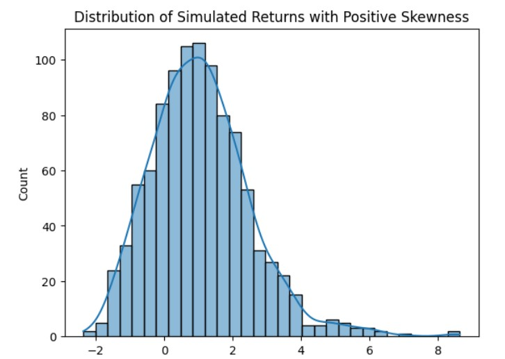

# Time-Series-Analysis-1 (FE_GWP_1)

## (A) Skewness:

### 1. Definition:

Skewness measures the asymmetry of the probability distribution of a
real-valued random variable.

Mathematically, skewness is defined as the third standardized moment:
Skewness=E\[(X−μ)3\]σ3Skewness=*σ*3E\[(*X*−*μ*)3\] where μ*μ* is the
mean, σ*σ* is the standard deviation, and EE is the expectation
operator.

### 2. Description:

Skewness indicates whether the data is skewed to the left (negative
skew) or right (positive skew). In financial time series, positive
skewness often indicates frequent small losses and a few extreme gains.
Negative skewness often indicates that asset is prone to sudden and
significant drop in value.

### 3. Demonstration & Diagram:

For Demonstration purpose we used simulated random data and introduced
positive skewness (.83)

In the above chart it displays positive skewness as most of the return
is clustered near zero or slightly negative values. A long tail suggests
fewer but extreme positive returns. This can help to understand that
downside risk is limited to as compared to upside potential. Also, since
mean is greater than median in this case average returns are inflated by
extreme positive values. This can help in forming trading strategies for
example buying OTM calls may profit from skewness. This distribution
highlights how infrequent large gains distort return profiles.

Recognizing positive skew helps traders and portfolio managers better
assess risk-reward asymmetries and adjust strategies accordingly.

# Diagnosis  {#diagnosis .unnumbered}

1)Skewness can be diagnosed by calculating the sample skewness
coefficient. A value significantly different from zero indicates
skewness.

2)Other way can be to plot the Distribution using Histogram or Box plot
or QQ plot.

3)Using Normality test like Jarque-Bera can help to identify Skewness.

**Damage:**

1)Ignoring skewness can lead to mispricing of derivatives, as models
like Black-Scholes assume symmetric returns.

This can result in incorrect hedging strategies and unexpected losses.

2)Investors might overestimate the likelihood of large wins due to
infrequent but memorable spikes.

3)Apart from this ignoring skewness can lead to overstating or
understanding of VaR measures.

# Directions  {#directions .unnumbered}

1)Use models that account for skewness, such as the Skew Normal
Distribution or Stochastic Volatility Models.

2)Transform the data using methods like Box-Cox transformation to reduce
skewness.

# Kurtosis / Heteroscedasticity Definition 

Kurtosis measures the \"tailedness\" of the probability distribution.
Excess kurtosis is defined as: Excess

Kurtosis=E\[(X−μ)4\]σ4−3Excess Kurtosis=σ4E\[(X−μ)4\]−3

Heteroscedasticity refers to the non-constant variance of a time series
over time.

# Description  {#description-1 .unnumbered}

High kurtosis indicates fat tails, meaning extreme values are more
likely. Heteroscedasticity is common in financial data, where volatility
clusters over time. **Demonstration**

For Demonstration purpose we have used S&P500 data downloaded from
yfinance with kurtosis as 10.03.

{width="5.083333333333333in"
height="3.6041666666666665in"}

For Normal Distribution Kurtosis is 3 but, in our case, high kurtosis of
10.03 indicates fat tails and extreme events. This high kurtosis means
higher probability of blackswan events(Like Covid, subprime crisis
etc.).In the volatility plot we can see high volatility period and
followed by calm periods. We can combine fat-tailed distributions with
dynamic volatility adjustments for robust forecasting.

# Diagnosis  {#diagnosis-1 .unnumbered}

1)Calculate the sample excess kurtosis. Values greater than 0 indicate
fat tails.

2)Heteroscedasticity: Use statistical tests like the ARCH-LM test or
visualize volatility clustering.

# Damage {#damage .unnumbered}

Ignoring kurtosis and heteroscedasticity can lead to underestimating the
risk of extreme events, resulting in poor risk management and derivative
pricing.

# Directions  {#directions-1 .unnumbered}

1)Use GARCH models to model time-varying volatility.

2)Incorporate Student's t-distribution or Generalized Error Distribution
(GED) to account for fat tails.

# 3.Addressing sensitivity to outliers Definition  {#addressing-sensitivity-to-outliers-definition .unnumbered}

Sensitivity to outliers refers to the extent to which a model\'s
predictions are influenced by extreme or atypical data points. A model
that is highly sensitive to outliers may exhibit significant changes in
its output even when a single value lies far outside the typical range
of the data.

# Description  {#description-2 .unnumbered}

Volatility models, especially those based on squared returns (like
GARCH), are highly sensitive to extreme values. Outliers can distort
model estimates, leading to overestimated or spurious volatility spikes
that do not reflect the actual market risk. This phenomenon has been
explored in detail in financial econometrics literature \[Bollerslev,
1986; Tsay, 2010; Cont, 2001\].

# Demonstration  {#demonstration .unnumbered}

We compare how different volatility models respond to outliers: Standard
GARCH(1,1) with Gaussian residuals, GARCH(1,1) with Student's
t-distribution, Rolling standard deviation.

For these purposes, we use synthetic data into which we have manually
introduced several outliers.

{width="4.722222222222222in"
height="2.4791666666666665in"}

The rolling standard deviation shows sharp, box-shaped spikes that last
exactly the length of the window, indicating high sensitivity to
individual extreme returns. GARCH with normal distribution produces a
smooth, gradually increasing volatility curve, showing little reaction
to outliers and potentially underestimating short-term risk. Since the
model usually reacts very poorly to outliers, the model puts a very low
coefficient before the return and hardly takes this value into account,
which leads to incorrect predictions that are not based on the real
market. In contrast, GARCH with Student's t-distribution displays
moderate, temporary spikes in volatility following each outlier, which
decay smoothly over time. This behavior suggests that the Student's
t-based GARCH model offers a balanced response---it is sensitive enough
to acknowledge large shocks but robust enough to prevent a single data
point from distorting the entire volatility forecast.

# Diagnosis {#diagnosis-2 .unnumbered}

There are several ways to address this challenge.

***Visual inspection.***

The easiest way and the first one to try is to visualize the data for
outliers. It is worth plotting both returns and volatility. If a single
extreme return causes a sharp and persistent spike in volatility,
followed by a slow decay--- even though returns normalize
afterward---this is classic outlier sensitivity.

***Statistical tests.***

There are statistical approaches to assess sensitivity to outliers.
These methods are widely used in regression and time series diagnostics
\[Hawkins, 1980\].

1)Cook's distance. It is a way to measure how much influence a single
data point has on a model's estimates. 2)ARCH-LM Test (Engle's Test).
This test checks whether there's any leftover autocorrelation in the
squared residuals after fitting a model.

3)Normality Tests on Residuals like Jarque-Bera Test or Shapiro-Wilk
Test. If a model assumes normal errors (like basic GARCH does), but the
residuals have fat tails or skewness, that's a sign that outliers are
distorting the model fit.

4)Other methods.

Another way to assess the impact of outliers is to check how the model
changes with and without them. This form of robustness check is commonly
used in outlier detection frameworks \[Rousseeuw & Leroy, 2005; Hodge &
Austin, 2004\]. Huge shifts in volatility forecasts after excluding a
single data point show that the model is fragile to outliers.

Compared with more robust methods. Less efficient but more robust
methods can be used as a baseline for evaluation. If the model readings
differ greatly at some points, this may be due to outliers

# Damage  {#damage-1 .unnumbered}

Volatility models that are highly sensitive to outliers can produce
distorted outputs, leading to serious consequences in trading, pricing,
and risk management.

1)Derivative Mispricing: Overreacting to an outlier may inflate
volatility estimates, resulting in overpriced options and unnecessary
hedging costs.

2)Overstated Risk Metrics: A single extreme return can cause exaggerated
risk forecasts, inefficient capital allocation, and unwarranted
de-risking.

3)Hedging Inefficiencies: Inaccurate forecasts lead to over- or
under-hedging, increasing P&L volatility and weakening risk control.

4)Model Instability: Models trained on outlier-contaminated data may
learn incorrect patterns, causing forecast drift and unreliable
decisions.

A notable example occurred during the COVID-19 \[Aggarwal, 2017\] crash
in March 2020, when volatility models reacted to extreme returns with
elevated risk estimates. This led to mis calibrated hedging, high
transaction costs, and increased exposure, ultimately reducing trading
effectiveness.

# Directions  {#directions-2 .unnumbered}

To reduce sensitivity to outliers in volatility modeling, several
approaches can be adopted. Robust statistics, including preprocessing
and distributional assumptions, have been shown to significantly improve
model stability \[Iglewicz & Hoaglin, 1993; Rousseeuw & Leroy, 2005\].
Below are some effective methods:

1)Data preprocessing. Applying winsorization, trimming, or outlier
detection algorithms (e.g., Grubbs' test or Zscore filtering) to clean
the return series before model fitting can prevent outliers from biasing
the estimation. 2)Use Realized Volatility. When high-frequency data is
available, realized volatility computed from intraday returns can
provide a more accurate and stable estimate that is less influenced by a
single outlier at the daily level. 3)Use Heavy-Tailed Distributions.
Replace the normal distribution with alternatives like the Student's t
or generalized error distribution to better handle extreme returns.

4)Consider Asymmetric or Non-Linear Models. Models like EGARCH or
GJR-GARCH, and machine learning methods (e.g., random forests, RNNs) can
be more resilient to outliers.

5)Apply Robust Estimation Methods. Robust estimation methods, such as
those based on Huber loss, Tukey's biweight function, or quantile-based
estimation, reduce the impact of extreme values during model fitting by
downweighing observations that deviate significantly from the median.

In summary, improving resilience to outliers requires careful model
selection, thoughtful data preprocessing, and the use of estimation
techniques that limit the impact of extreme values. Adopting these
practices leads to more stable and reliable volatility forecasts.

**4.Modeling non-stationarity and finding a unit Root Testing
Definition:**

A non-stationarity time series is a series which does not have constant
mean and variance. A non-stationary time series has long term trends,
seasonality and often has a unit root of the characteristic equation.

**Description:**

In non-stationary time series, mean and variance are dependent on time,
that is they change with time and one or more roots of the
characteristic equation is equal to one which can be found using unit
root testing. If the absolute value of one of the coefficients of its
past value is equal to one, then it becomes a random walk series.
Because of these factors time series cannot converge and mean is not
centered around a particular value.

**Demonstration & Diagram:**

For demonstration, we used real world data of NVIDIA stock from 1st Jan
2023 to 1st Jan 2025. The above figure shows the stock price and daily
return movement. From the graph, the stock price shows an upward trend
with some high variance time sections. But its daily return over the
same period is centered around a particular value (approx. 0.0) but
whose variance is different for different periods. Here daily return
calculation does difference of time series. Please see the accompanying
python file to see the Augmented Dickey-Fuller (adf) test
implementation. In our data of NVIDIA stock price, the daily stock
prices adf test has p value greater than 0.05 making it non-stationary
whereas p value is lower than 0.05 for daily return making it
stationary.

{width="5.868055555555555in"
height="3.138888888888889in"}

**Diagnosis:**

1)First can we check directly from the stock price graph to see if there
is trend and/or seasonality present in the time series.

2)Plot the ACF and PACF for the time series. If the ACF decays slowly
then it is non-stationary

3)There are few formal tests available like Augmented Dickey-Fuller
(adf) test which checks for unit root. If the p value is greater than
0.05 then we accept the null hypothesis that unit root exists.

**Damage:**

1)Since the underlying statistics like mean and variance are not
constant over time, you cannot fit a regression line, and the forecast
will have unreliable results as previous data can be significantly
different from present or future data.

2)Like regression, one cannot do statistical inferences like hypothesis
testing reliably because no constant mean and variance violates the
assumptions required.

3)Another problem is there is no easy or simpler model present to model
non-stationarity. All models like AR(), MA, Garch, ARIMA all require
stationarity, ARIMA does differencing to make the series stationary.

**Direction:**

1)Try different transformation techniques like log transformation,
squared or box-cox transformation which can make the series stationary.

2)Tty differencing (1st order, 2nd order) which can remove
non-stationary from trends and seasonality. 3)Use models like ARIMA,
which takes care of non-stationarity by including differencing
component. There are state space models which are dynamic and take care
of all types non-stationary but are complex to implement. In the python
file we used ARIMA(1,1,1) model with 1st order differencing because it
has lowest aic.

4)If one can make the mean constant or converge to near to one value
after transformation even if the series variance does not become
constant then we can use the GARCH model.

5)We can use RNN and Deep learning techniques to model non stationary
time series.

**Summary:**

Ignoring skewness can lead to mispricing of derivatives, overestimation
of large wins, and incorrect Value-at-Risk (VaR) measures. High kurtosis
and heteroscedasticity may result in underestimating extreme event
risks, poor risk management, and flawed derivative pricing. Sensitivity
to outliers can distort volatility models, causing derivative
mispricing, overstated risk metrics, hedging inefficiencies, and model
instability. Non-stationarity in time series violates key statistical
assumptions, making regression, hypothesis testing, and forecasting
unreliable, while complicating model selection due to the lack of simple
solutions for non-stationary data.

To address skewness, use models like the Skew Normal Distribution or
apply data transformations (e.g., Box-Cox). For kurtosis and
heteroscedasticity, employ GARCH models or heavy-tailed distributions
(e.g., Student\'s t). Mitigate outlier sensitivity by preprocessing data
(e.g., winsorization), using robust estimation methods, or adopting
asymmetric models (e.g., EGARCH). For non-stationarity, apply
transformations (e.g., differencing, log), use ARIMA models, or explore
machine learning techniques like RNNs. Combining these approaches
ensures more accurate risk assessment, stable forecasts, and resilient
financial modeling.

# References  {#references .unnumbered}

Bollerslev, T. (1986). Generalized Autoregressive Conditional
Heteroskedasticity. Journal of Econometrics, 31(3),

307--327. https://doi.org/10.1016/0304-4076(86)90063-1

Tsay, R. S. (2010). Analysis of Financial Time Series (3rd ed.). Wiley.

Cont, R. (2001). Empirical properties of asset returns: stylized facts
and statistical issues. Quantitative Finance, 1(2),

223--236. https://doi.org/10.1080/713665670

Rousseeuw, P. J., & Leroy, A. M. (2005). Robust Regression and Outlier
Detection. Wiley-Interscience.

Iglewicz, B., & Hoaglin, D. C. (1993). How to Detect and Handle
Outliers. ASQC Quality Press.

Hodge, V. J., & Austin, J. (2004). A Survey of Outlier Detection
Methodologies. Artificial Intelligence Review, 22(2), 85--126.
https://doi.org/10.1023/B:AIRE.0000045502.10941.a9 Hawkins, D. M.
(1980). Identification of Outliers. Springer.

Aggarwal, C. C. (2017). Outlier Analysis (2nd ed.). Springer.
